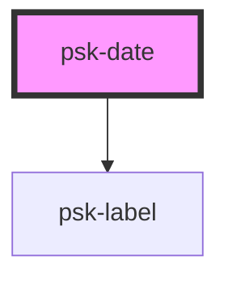

# psk-label

<!-- Auto Generated Below -->

## Properties

| Property      | Attribute      | Description | Type               | Default                     |
| ------------- | -------------- | ----------- | ------------------ | --------------------------- |
| `format`      | `format`       |             | `string`           | `'mm dd yyyy'`              |
| `hoverFormat` | `hover-format` |             | `string`           | `DATE_FORMAT_MASKS.default` |
| `value`       | `value`        |             | `number \| string` | `null`                      |

## Dependencies

### Depends on

- [psk-label](../form-components/psk-label)

### Graph

----------------------------------------------

*Built with [StencilJS](https://stenciljs.com/)*
