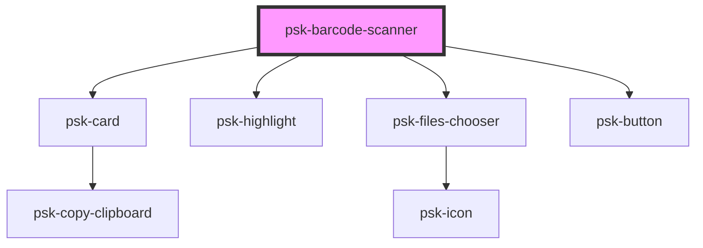

# psk-barcode-scanner

<!-- Auto Generated Below -->

## Properties

| Property            | Attribute             | Description | Type      | Default     |
| ------------------- | --------------------- | ----------- | --------- | ----------- |
| `allowFileBrowsing` | `allow-file-browsing` |             | `boolean` | `false`     |
| `data`              | `data`                |             | `any`     | `undefined` |
| `normalSize`        | `normal-size`         |             | `boolean` | `false`     |
| `title`             | `title`               |             | `string`  | `""`        |

## Dependencies

### Depends on

- [psk-card](../../psk-card)
- [psk-highlight](../../psk-highlight)
- [psk-files-chooser](../../psk-files-chooser)
- [psk-button](../../psk-button)

### Graph

----------------------------------------------

*Built with [StencilJS](https://stenciljs.com/)*
