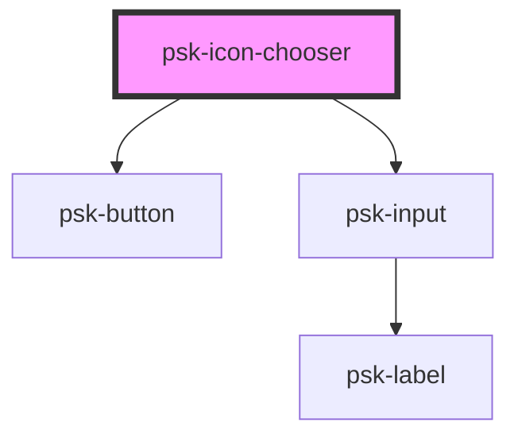

# psk-icon-chooser

<!-- Auto Generated Below -->

## Properties

| Property     | Attribute     | Description | Type     | Default     |
| ------------ | ------------- | ----------- | -------- | ----------- |
| `iconsColor` | `icons-color` |             | `string` | `undefined` |
| `iconsSize`  | `icons-size`  |             | `string` | `undefined` |
| `value`      | `value`       |             | `string` | `null`      |

## Dependencies

### Depends on

- [psk-button](../psk-button)
- [psk-input](../form-components/psk-input)

### Graph

----------------------------------------------

*Built with [StencilJS](https://stenciljs.com/)*
